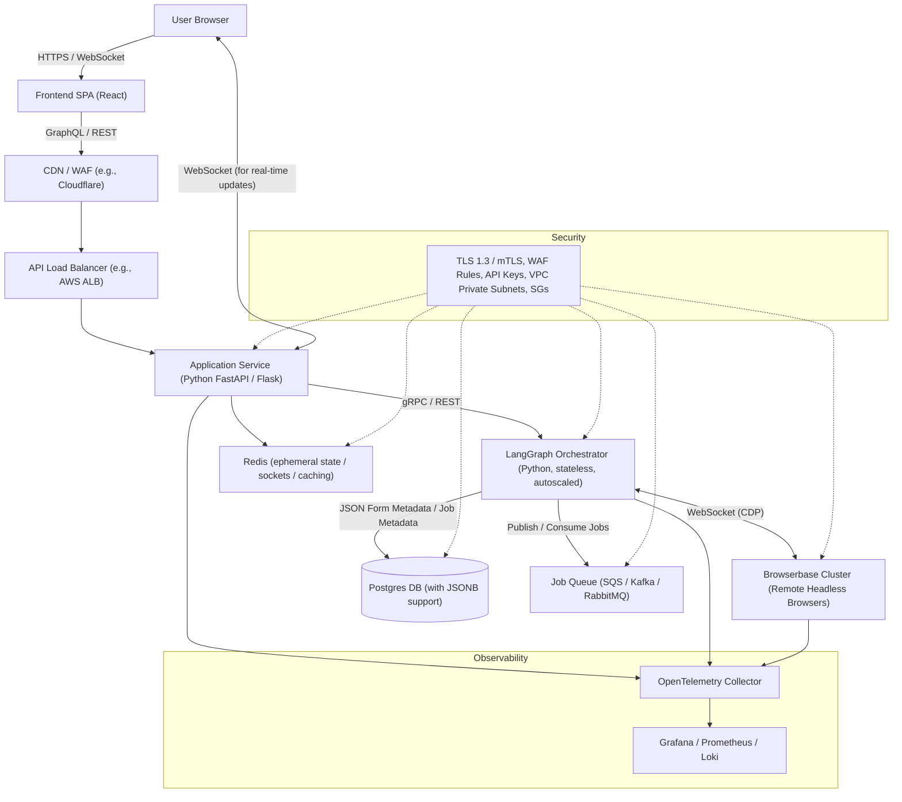
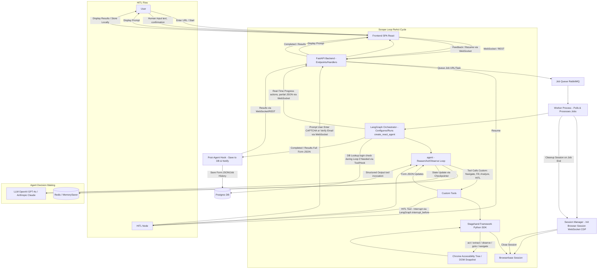

# Multi-Tier Architecture

## High-Level Architecture

### Description
1. **Frontend SPA (React)** – A single-page application served via CDN/WAF for security and performance. It handles user input (e.g., URL entry, "Start" button), displays real-time agent progress via WebSocket, and manages HITL prompts/interventions. Uses libraries like Socket.io for WebSocket handling and Material-UI for UI components.
2. **API Load Balancer & Service (Python FastAPI/Flask)** – Stateless layer handling authentication (e.g., JWT/OAuth), scrape request validation, and proxying WebSocket traffic for agent updates. Exposes GraphQL/REST endpoints for initiating jobs and querying status. Integrates with LangGraph for job orchestration.
3. **LangGraph Orchestrator (Python)** – Core component using `create_react_agent` from LangGraph to manage ReAct-style agents. Stateless instances are autoscaled (e.g., via Kubernetes or AWS ECS) based on queue load. Handles tool calls, state persistence via checkpointers (e.g., Redis or Postgres-based), and integration with Stagehand for browser actions. Publishes long-running scrapes to the job queue for async processing.
4. **Browserbase Cluster** – Remote, headless browser service (e.g., via Browserbase.com) providing scalable, secure sessions. Connected via WebSocket (Chrome DevTools Protocol - CDP) for low-latency control. Executes actions in isolated environments to avoid IP blocks and ensure compliance. Monitored for session health and timeouts.
5. **Postgres DB** – Persistent storage for scraped form-field metadata (as JSONB columns for flexible schema), website keys (e.g., unique by domain), user accounts, job history, and audit logs. Schema includes tables like `websites` (id, domain, requires_login bool), `form_fields` (website_id fk, field_json jsonb), and `scrape_jobs` (id, status, results_json jsonb). Supports indexing on JSONB for efficient queries.
6. **Redis** – Used for ephemeral data like active WebSocket connections, agent session states (e.g., partial form JSON during scraping), caching DB lookups (e.g., login requirements), and rate limiting. Configured with eviction policies for memory management.
7. **Job Queue (SQS/Kafka/RabbitMQ)** – Buffers scrape requests for asynchronous, fault-tolerant processing. Allows decoupling of API from LangGraph, enabling retries on failures (e.g., browser crashes) and prioritization of jobs.
8. **Observability** – Implements distributed tracing (OpenTelemetry), metrics (Prometheus), and logging (Loki/ELK) for end-to-end visibility. Dashboards track agent loops, tool call latencies, error rates, and resource usage. Alerts for anomalies like high failure rates or session timeouts.
9. **Security Controls** – Enforce TLS/mTLS everywhere; WAF for DDoS/XSS protection; API keys/secrets management (e.g., AWS Secrets Manager) for LLM/Browserbase credentials; network isolation via VPC private subnets and security groups; encrypted storage (e.g., Postgres at-rest encryption); role-based access control (RBAC) for users; compliance with GDPR/CCPA for data handling. Avoid storing sensitive form data (e.g., passwords) in DB.

### Additional Considerations
- **Scalability**: Horizontal scaling for API and LangGraph via containers. Browserbase handles browser scaling natively. Use auto-scaling groups based on queue depth or CPU metrics.
- **Deployment**: Containerized (Docker) on Kubernetes/AWS ECS for orchestration. CI/CD with GitHub Actions or Jenkins.
- **Cost Optimization**: Use spot instances for non-critical LangGraph workers; monitor Browserbase usage to avoid over-provisioning.
- **Error Handling**: Global try-catch in LangGraph for tool failures, with retries (e.g., max 3) and fallbacks to HITL. Queue dead-letter for failed jobs.

---

## Low-Level Architecture (Agent–Run Flow)

