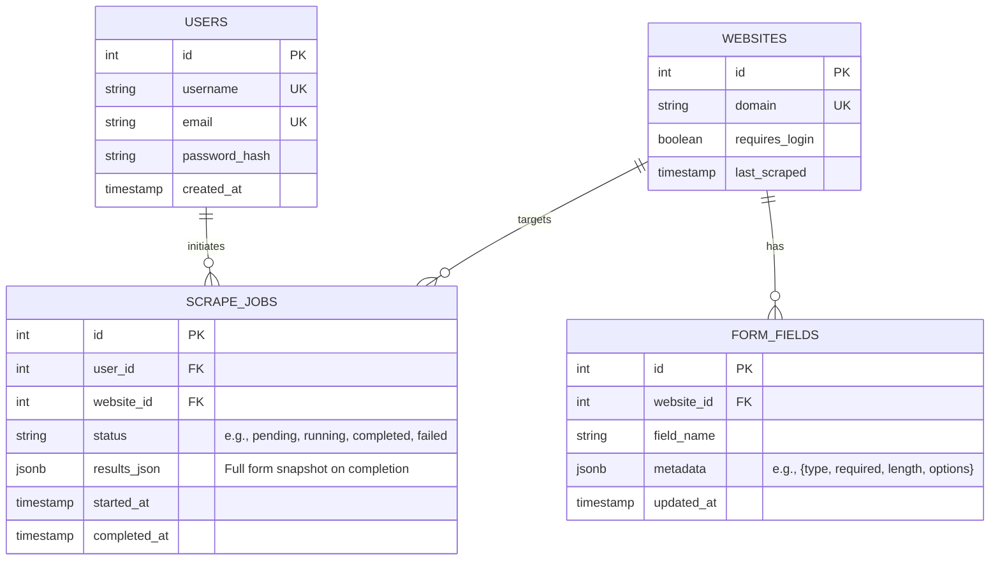

# Data Model and Entity Relationship Diagram

This document outlines the data model for the web form scraping application. The model focuses on storing website metadata, scraped form fields (with flexible JSONB for metadata like required length, options, etc.), scrape job history, and user accounts for authentication and job ownership. The design uses PostgreSQL with JSONB for semi-structured data to handle varying form structures.

## Key Entities and Assumptions
- **Users**: Represents application users who initiate scrapes. Includes basic auth fields.
- **Websites**: Core entity for scraped sites, keyed by domain. Includes flags like `requires_login`.
- **FormFields**: Stores individual form fields per website. Each field has metadata stored in JSONB (e.g., `{"type": "text", "required": true, "length": 50, "options": ["opt1", "opt2"]}`) for flexibility.
- **ScrapeJobs**: Tracks scrape requests, their status, and results (e.g., full form JSON snapshot at completion).
- Relationships:
  - A User can initiate many ScrapeJobs.
  - A Website can have many FormFields and be referenced in many ScrapeJobs.
  - Assumptions: FormFields are granular (one row per field) for query efficiency, but could be aggregated if needed. No direct User-Website link, as access is job-based.

## Entity Relationship Diagram (ERD)

