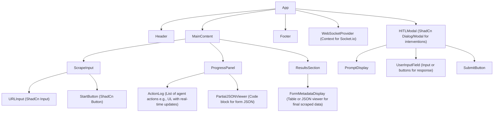
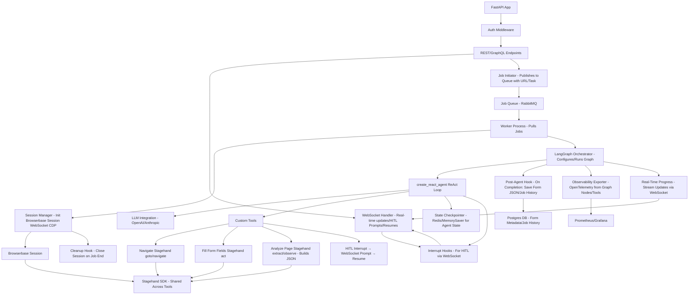

# Frontend Design

## Key Design Principles
- **Modular Components**: Use reusable ShadCn components (e.g., Button, Input, Card, Modal) to build the UI.
- **State Management**: Use React Context or Zustand for global state (e.g., scrape job status, form JSON, WebSocket connection).
- **Real-Time Updates**: Socket.io listens for events like 'progress_update', 'hitl_prompt', 'scrape_complete' from the backend.
- **Error Handling**: Display toasts/alerts for issues (e.g., invalid URL, connection errors) using ShadCn's Toast component.
- **Accessibility**: Follow ARIA standards; ensure keyboard navigation and screen reader compatibility.
- **Routing**: Minimal, as it's an SPA. Use React Router if expanding to multi-page (e.g., dashboard, history).

## Component Hierarchy

The following Mermaid diagram illustrates the high-level component tree. It starts from the root `App` component and branches into main sections.



### Description of Key Components
- **App**: Root component wrapping everything in providers (e.g., ThemeProvider, SocketProvider).
- **Header**: Branding, user auth (if needed), theme toggle.
- **ScrapeInput**: Form for URL entry and start button. Validates URL on submit.
- **ProgressPanel**: Real-time log of agent actions (e.g., "Navigating to page...", "Extracting fields..."). Uses Socket.io to append updates.
- **ResultsSection**: Hidden until complete; displays scraped form JSON in a readable format (e.g., collapsible tree or table).
- **HITLModal**: Pops up on backend prompt (e.g., for CAPTCHA). User inputs response, which is sent back via WebSocket.
- **Footer**: Status indicators (e.g., connection status) or credits.

## File Structure

Organize files in a feature-based structure for scalability. Below is an ASCII art representation of the directory layout.

```
src/
├── assets/                # Images, icons, etc.
├── components/            # Reusable UI components
│   ├── common/            # Shared (e.g., Button.tsx, Input.tsx from ShadCn)
│   ├── Header.tsx
│   ├── Footer.tsx
│   ├── ScrapeInput.tsx
│   ├── ProgressPanel.tsx
│   ├── ResultsSection.tsx
│   └── HITLModal.tsx
├── contexts/              # React Contexts
│   └── SocketContext.tsx  # For WebSocket state and methods
├── hooks/                 # Custom hooks
│   └── useSocket.ts       # Hook for Socket.io connection
├── pages/                 # If using routing; otherwise, merge into components
│   └── MainPage.tsx       # Core SPA content
├── services/              # API/WebSocket utilities
│   └── socketService.ts   # Socket.io client setup
├── types/                 # TypeScript interfaces
│   └── index.ts           # e.g., ScrapeJob, FormFieldMetadata
├── utils/                 # Helpers (e.g., URL validator)
│   └── validators.ts
├── App.tsx                # Root component
├── main.tsx               # Entry point (Vite)
└── index.css              # Tailwind base styles
```

- **Why this structure?**: Separates concerns (UI, state, services) for easy maintenance. Components are atomic and composable.

## UI Layout Sketch

Here's a simple ASCII art mockup of the main screen layout (desktop view). It's divided into sections for input, progress, and results.

```
+-----------------------------------------------+
| Header: App Logo | Theme Toggle | User Menu    |
+-----------------------------------------------+
|                                               |
| ScrapeInput:                                  |
|   [ URL Input Field ]     [ Start Button ]    |
|                                               |
+-----------------------------------------------+
| ProgressPanel:                                |
|   - Action Log (Scrollable List):             |
|     > Connecting to agent...                  |
|     > Navigating to https://example.com...    |
|     > Extracting form fields...               |
|   - Partial JSON Viewer:                      |
|     { "field1": { "type": "text", ... } }     |
|                                               |
+-----------------------------------------------+
| ResultsSection (Hidden until done):           |
|   Final Form Metadata:                        |
|   - Table or JSON Tree View                   |
|                                               |
+-----------------------------------------------+
| Footer: Connection Status | Version Info      |
+-----------------------------------------------+

[ HITLModal Overlay (on prompt) ]
  Prompt: "Enter CAPTCHA code:"
  [ Input Field ]
  [ Submit Button ]
```

- **Mobile Responsiveness**: Stack sections vertically; use Tailwind's responsive classes (e.g., `flex-col md:flex-row`).
- **Styling**: Apply Tailwind classes directly in components (e.g., `className="p-4 bg-gray-100 dark:bg-gray-800"`). Use ShadCn for pre-styled elements to speed up development.

## Data Flow and Interactions
- **On Load**: Establish WebSocket connection via `useSocket` hook.
- **Start Scrape**: User submits URL → Emit 'start_scrape' event with { url } → Backend initiates LangGraph agent.
- **Real-Time Updates**: Listen for 'progress_update' → Append to action log state → Re-render ProgressPanel.
- **HITL**: On 'hitl_prompt' event → Open modal with prompt → User submits → Emit 'hitl_response' with input.
- **Completion**: On 'scrape_complete' → Update results state → Show ResultsSection with form JSON.
- **State Example**: Use a global store like:
  ```typescript
  interface AppState {
    jobStatus: 'idle' | 'running' | 'complete' | 'error';
    actionLog: string[];
    partialForm: Record<string, any>;
    finalResults: Record<string, any>;
    hitlPrompt: string | null;
  }
  ```

# Backend Design

## Key Design Principles
- **Modular Services**: Break down into API layer (FastAPI), orchestrator (LangGraph), and tools (browser integrations). Use dependency injection for components like DB connections.
- **State Management**: Persistent state in Postgres; ephemeral in Redis. LangGraph uses checkpointers for agent state.
- **Async Processing**: Leverage FastAPI's async routes and WebSockets for real-time updates. Queue long-running scrapes to avoid blocking.
- **Error Handling**: Centralized exception handlers in FastAPI; retries in LangGraph tools (e.g., max 3 attempts); fallbacks to HITL on failures.
- **Security**: JWT auth for endpoints; API keys for external services (e.g., Browserbase, OpenAI); input validation with Pydantic.
- **Logging and Monitoring**: Use structlog for structured logs; OpenTelemetry for traces/metrics exported to Prometheus/Grafana.

## Component Hierarchy

The following Mermaid diagram illustrates the high-level backend architecture flow, from API entry to agent execution and data flow.



### Description of Key Components
- **FastAPI App**: Entry point with routes for /start-scrape (POST), /jobs/{id} (GET), and WebSocket at /ws for real-time.
- **Auth Middleware**: Validates JWT for protected routes.
- **Job Initiator**: Validates requests, publishes to queue, returns job ID.
- **LangGraph Orchestrator**: Consumes from queue; spawns agents with tools bound to LLM.
- **Custom Tools**: Pydantic-defined for schema; wrap browser actions and DB ops.
- **Browser Integrations**: Establish sessions on-demand; close on completion to free resources.
- **DB/Redis**: Use SQLAlchemy for Postgres ORM; aioredis for async Redis access.
- **Observability**: Instrument FastAPI and LangGraph with OpenTelemetry auto-instrumentation.

## File Structure

Organize files in a modular structure for maintainability. Below is an ASCII art representation of the directory layout.

```
backend/
├── app/                   # Core application
│   ├── api/               # FastAPI routes and handlers
│   │   ├── endpoints.py   # REST/GraphQL routes (e.g., start_scrape)
│   │   ├── websockets.py  # WebSocket handlers for updates/HITL
│   │   └── dependencies.py # Shared deps (e.g., DB session, auth)
│   ├── agents/            # LangGraph components
│   │   ├── orchestrator.py # Main LangGraph setup (create_react_agent)
│   │   ├── tools.py       # Custom tools (Navigate, Fill, Analyze, HITL)
│   │   └── state.py       # Custom AgentState schema
│   ├── browser/           # Browser integrations
│   │   ├── browserbase.py # Session management
│   │   └── stagehand.py   # Wrappers for act/extract/observe
│   ├── db/                # Database interactions
│   │   ├── models.py      # SQLAlchemy models (Users, Websites, etc.)
│   │   ├── crud.py        # CRUD operations
│   │   └── session.py     # DB connection setup
│   ├── queue/             # Job queue handling
│   │   └── consumer.py    # Listener for RabbitMQ, triggers orchestrator
│   ├── observability/     # Monitoring setup
│   │   └── tracing.py     # OpenTelemetry configuration
│   ├── main.py            # FastAPI app entry point
│   └── config.py          # Settings (e.g., env vars, Pydantic settings)
├── migrations/            # Alembic for DB migrations
├── tests/                 # Unit/integration tests
│   ├── test_api.py
│   └── test_agents.py
├── requirements.txt       # Dependencies (fastapi, langgraph, etc.)
└── Dockerfile             # For containerization
```

- **Why this structure?**: Groups by feature (api, agents, browser) for clear separation. Config and tests are top-level for easy access.

## Request Flow Sketch

```
User (Frontend) --> [HTTPS/WebSocket] --> FastAPI App
  |
  v
Auth Middleware --> Validate JWT --> [403 if invalid]
  |
  v
Endpoint: /start-scrape (POST {url})
  - Validate URL
  - Publish Job to Queue --> Job ID Response to User
  |
  v
Queue Consumer (Async Worker)
  - Pull Job
  - Spawn LangGraph Agent
    |
    v
  ReAct Loop:
    - Reason (LLM Call)
    - Act (Tool Call: e.g., Browserbase Session --> Stagehand act())
    - Observe (Update State --> Redis)
    - DB Ops (Store Form JSON --> Postgres)
    - HITL? --> WebSocket Prompt to Frontend --> Await Response
    - Progress Update --> WebSocket Emit to User
  |
  v
Completion/Failure
  - Store Results (Postgres)
  - Emit 'scrape_complete' via WebSocket
  - Trace/Metrics to OpenTelemetry
```

- **Async Considerations**: Use `asyncio` for non-blocking ops; background tasks in FastAPI for queue publishing.
- **Scaling**: Run multiple queue consumers; use Kubernetes for pod scaling based on queue depth.

## Data Flow and Interactions
- **On Startup**: Load config (e.g., API keys from env); init DB connections, queue listeners, OpenTelemetry.
- **Scrape Initiation**: API receives URL → Queue job {url, user_id} → Consumer starts agent with state {url, form_json: {}}.
- **Tool Executions**: Tools async; e.g., Navigate: Init Browserbase session → Stagehand goto(url) → Return page state.
- **HITL**: Tool raises interrupt → Emit 'hitl_prompt' via WebSocket → Await 'hitl_response' → Resume agent.
- **Completion**: Agent stops on condition (e.g., form complete) → Update job status in DB → Emit results.
- **Example Config**: Use Pydantic Settings for env vars:
  ```python
  from pydantic_settings import BaseSettings

  class Settings(BaseSettings):
      database_url: str
      redis_url: str
      browserbase_api_key: str
      openai_api_key: str
      # etc.
  ```
